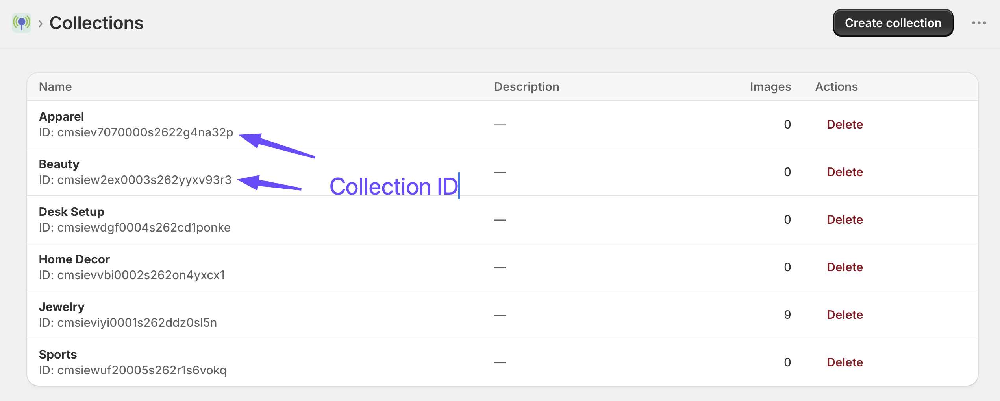

[← Back to Home](index)

---

# Collections

A **collection** is a group of shoppable images. Put several images in one collection and you can render all of them with a single theme block, as a responsive grid or masonry layout.

Collections are available on **every plan, including Free**.

* TOC
{:toc}

---

## When to Use a Collection

Use a *Shoppable Image* block when you have one hero photo to make shoppable.

Use a *Shoppable Collection* block when you have several related photos — a full lookbook, a room-by-room catalogue, a season's campaign shots. One block renders the whole set, and adding a new photo to the collection later puts it on your storefront without touching the theme again.

---

## Creating a Collection

1. Go to **Collections** in the app navigation.
2. Click **Create collection**.
3. Enter a **Name** — required. This is what you will see in the app, and it is also what shoppers see if you sort the grid alphabetically.
4. Enter a **Description** — optional, for your own reference.
5. Click **Save**.

---

## Adding Images to a Collection

An image belongs to at most one collection. There are two ways to assign it:

**From the image** — open the image's **Edit** screen and pick a collection from the *Collection* dropdown. You can also set this when you first create the image.

**From the collection** — open the collection and use its **Images** section to assign existing images.

---

## Managing a Collection

Open a collection to see its details and its **Images (N)** table, listing every image assigned to it.

From here you can:

- **Edit** the collection name and description.
- **Remove from collection** — takes an image out of the collection. The image itself is untouched: it keeps its hotspots, its click history, and its own *Shoppable Image* block if it has one. It simply stops appearing in this collection's grid.
- Open any image to edit its hotspots.

---

## Finding the Collection ID

The **collection ID** is what connects a collection to a *Shoppable Collection* block in your theme. It is shown on the collections list and on the collection's own page. Copy it and paste it into the block's **Collection ID** setting — see [Theme Blocks](theme-blocks).

---

## Deleting a Collection

Open the collection and use **Delete collection**.

> **Note:** Deleting a collection **does not delete its images**. They are simply unassigned — every image keeps its hotspots, its published state, and its click history, and any *Shoppable Image* block pointing at one of them keeps working.
>
> What does stop working is any *Shoppable Collection* block still pointing at the deleted collection's ID. Remove or repoint that block in your Theme Editor.

---

## Which Images Appear in the Grid

A collection block only renders images that are **published** and **not locked** by the Free plan.

That means on the Free plan, a collection of ten images will show only your three most recent ones on your live storefront. The other seven stay in the collection and come back automatically when you upgrade. See [Billing & Plans](billing).

---

## Ordering the Grid

The order images appear in is a **block setting**, not a property of the collection. In the Theme Editor you can choose:

| Order by | Result |
|---|---|
| **Newest** | Most recently created image first *(default)* |
| **Oldest** | Oldest image first |
| **Title (A–Z)** | Alphabetical by the image's title, with numbers sorted naturally (so *Look 2* comes before *Look 10*) |

Because "Title (A–Z)" sorts on the image title, naming your images consistently — *"Look 01"*, *"Look 02"* — gives you full manual control over the grid order.

---

## Enlarging Images in a Grid

Grid thumbnails are, by definition, small — which is exactly where a lot of hotspot detail gets lost. The collection block's **Open image in full-page popup on click** setting lets shoppers click any image in the grid to open it full-page, at proper size, with its hotspots still working.

This pairs particularly well with a three- or four-column grid: the grid stays compact on the page, and each photo is one click away from being properly browsable.

The setting is on by default and applies to every image in the grid. It is an **Ultimate plan** feature — see [Theme Blocks](theme-blocks#plan-gated-settings).

---

[← Back to Home](index)
