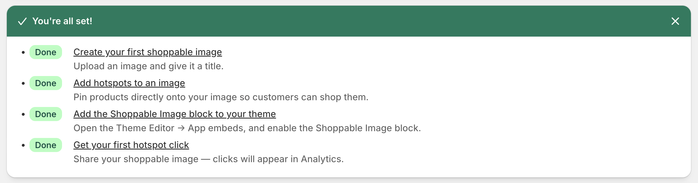
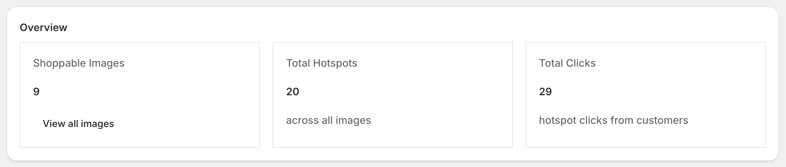
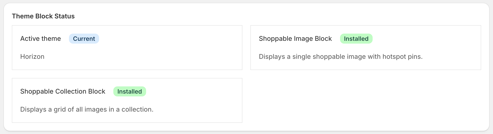
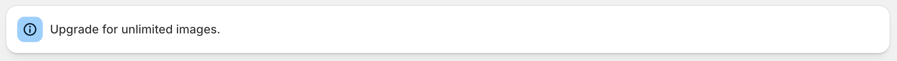
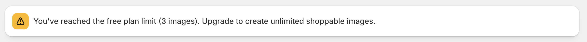

[← Back to Home](index)

---

# Getting Started

* TOC
{:toc}

---

## Installing the App

1. Open the **Shoppable Image Hotspots** listing on the Shopify App Store.
2. Click **Install**.
3. Review the permissions and click **Install app**.

The app opens directly to the **Dashboard**, and you start on the **Free plan** — no payment details required.

---

## Permissions the App Requests

| Permission | Why it is needed |
|---|---|
| `read_products` | Search your catalogue in the hotspot editor and read product titles, images, and prices |
| `write_products` | Required alongside product read access by Shopify's product scope pairing |
| `read_files` | List the images already in your Shopify **Content → Files** library so you can pick one |
| `write_files` | Upload a new image from your computer into your Files library |
| `read_themes` | Detect whether the app blocks have been added to your published theme, so the Dashboard can show you the correct next step |

The app does **not** request access to customers, orders, or checkout. It never reads or stores customer personal data — see the [Privacy Policy](privacy-policy).

---

## The Onboarding Checklist

The Dashboard shows a four-step checklist. Each step ticks itself off as you complete it.

### Step 1 — Create a shoppable image

Upload a new image or pick one that is already in your Shopify Files library. See [Images](images).

### Step 2 — Add hotspots

Open the image and click anywhere on it to drop a pin, then attach a product. See [Hotspots](hotspots).

### Step 3 — Add the block to your theme

Open the Theme Editor and add the **Shoppable Image** app block to a page, then paste in the image ID. See [Theme Blocks](theme-blocks).

### Step 4 — Check your analytics

Once shoppers start tapping pins, the Analytics page fills in. See [Analytics](analytics).

---

## The Dashboard

The Dashboard is the app's home screen. It shows:

**Stats**

| Tile | What it counts |
|---|---|
| Shoppable Images | Every image you have created, including hidden and locked ones |
| Total Hotspots | Every pin across every image |
| Total Clicks | Every recorded hotspot open, all time |

**Theme block status**

The Dashboard checks your **published (main) theme** and tells you whether the *Shoppable Image* and *Shoppable Collection* blocks have been added. If a block is missing, you get a button that deep-links you straight into the Theme Editor with the block ready to insert.

> **Note:** The theme check only inspects your **home page template** (`templates/index.json`). If you added the block to a different page — a product page, a custom landing page, a lookbook page — the Dashboard will still report the block as "not added". That is only a detection limitation; your block works perfectly well wherever you put it. See [Theme Blocks](theme-blocks#the-dashboard-says-the-block-is-not-added-but-it-is).

**Plan banners**

If you are on the Free plan you will see one of two banners:

- *"Free plan: N of 3 images used"* — informational, while you still have room.
- *"Free plan limit reached (3 images)"* — you have hit the cap. Any images beyond the 3 most recent are locked. See [Billing & Plans](billing).

---

## A Typical First Setup

A complete first run takes about five minutes:

1. **Images → Create image.** Give it a title such as *"Spring lookbook — hero"* and pick the photo.
2. On the editor screen, **click the photo** where the first product appears. Search for that product, pick it, and save.
3. Repeat for every product visible in the photo. There is no limit on hotspots.
4. Copy the **image ID** shown on the image list.
5. Open **Online Store → Themes → Customize**, add the **Shoppable Image** block where you want it, and paste the image ID into the block's *Image ID* setting.
6. **Save** the theme and view the page on your storefront.

---

[← Back to Home](index)
