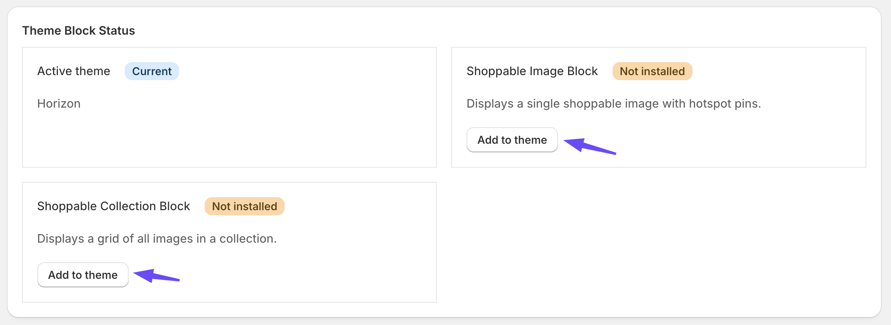
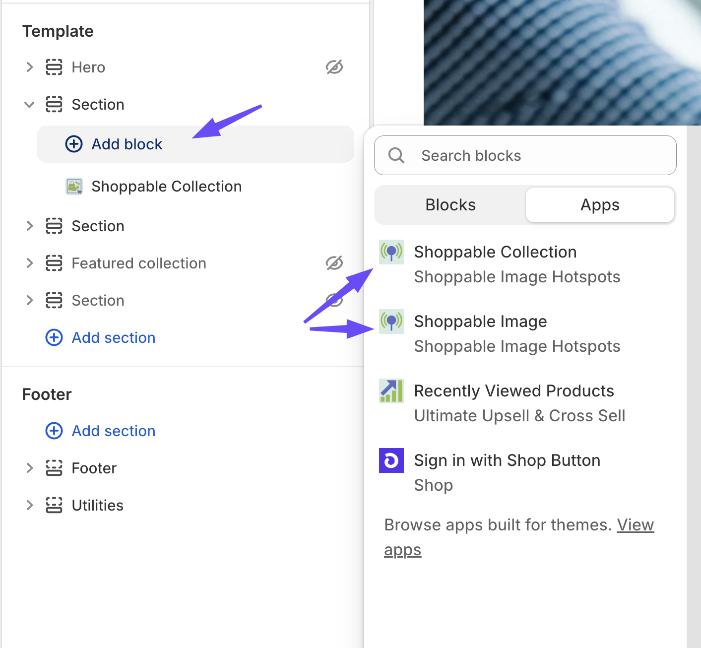
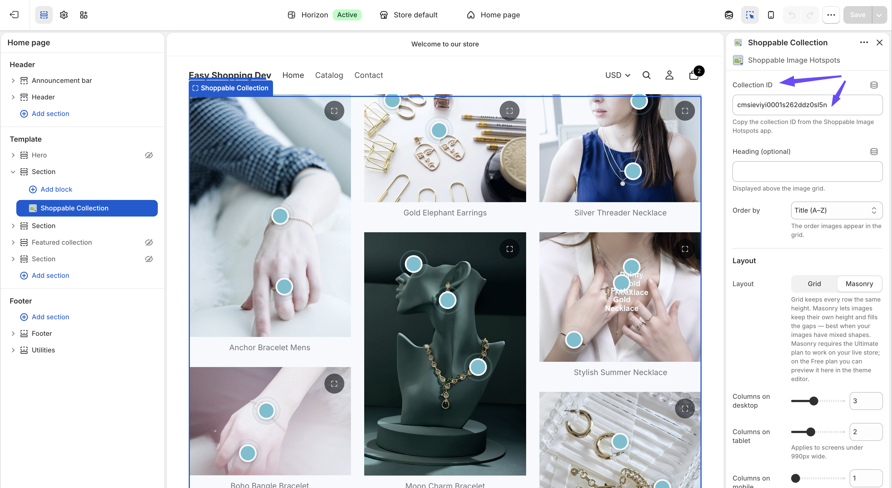

[← Back to Home](index)

---

# Theme Blocks

The app ships two **app blocks** that you add through the Shopify Theme Editor. No theme code editing is required.

* TOC
{:toc}

---

## Requirements

Your published theme must support app blocks — that is, it must be an **Online Store 2.0** theme. Every free Shopify theme and almost every paid theme released in the last few years qualifies.

If you are on a very old theme and the *Apps* section does not appear in the Theme Editor, you will need to update your theme before the blocks can be added.

---

## The Two Blocks

| Block | Use it for | Needs |
|---|---|---|
| **Shoppable Image** | One image with hotspots | An image ID — see [Images](images#finding-the-image-id) |
| **Shoppable Collection** | A grid of several images | A collection ID — see [Collections](collections#finding-the-collection-id) |

Both are **section-level** blocks, which means you add them as their own section on the page rather than nesting them inside an existing one.

---

## Adding a Block

### The quick way

On the app's **Dashboard**, the theme block status card gives you a direct link that opens the Theme Editor with the block ready to insert. Click it, position the section, fill in the ID, and save.

### The manual way

1. In Shopify admin, go to **Online Store → Themes**.
2. Click **Customize** on the theme you want to edit.
3. Use the page selector at the top to open the page you want the block on — home page, a product page, a custom page, and so on.
4. Click **Add section**.
5. Under the **Apps** heading, choose **Shoppable Image** or **Shoppable Collection**.
6. Drag the section to where you want it on the page.
7. Fill in the **Shoppable Image ID** or **Collection ID** setting.
8. Adjust the rest of the settings as needed.
9. Click **Save**.

You can add as many blocks as you like, on as many pages as you like, each pointing at a different image or collection.

---

## Shoppable Image — Settings

| Setting | Type | Default | What it does |
|---|---|---|---|
| **Shoppable Image ID** | Text | *(empty)* | The image to render. Copy it from the app's Images list. **Required** — the block shows nothing without it |
| **Maximum width (px)** | 400–1800, step 50 | 1600 | Caps how wide the image renders. The image is always responsive below this width |
| **Open image in full-page popup on click** | Checkbox | On | Lets shoppers click the image, or tap the expand control, to view it enlarged in a full-page popup with the hotspots still working. **Ultimate plan** — see below |
| **Show "Add to cart" in product cards** | Checkbox | Off | Adds an *Add to cart* button, with variant selection, to each product card. **Ultimate plan** — see below |
| **"View product" opens in** | Same tab / New tab | Same tab | Where the product link goes |
| **Pin color** | Colour | `#5c6ac4` | The pin's normal colour |
| **Pin hover color** | Colour | `#202e78` | Used on hover, and while the pin's product card is open |
| **Pin text color** | Colour | `#ffffff` | Colour of the pin's label text or **+** icon |

---

## Shoppable Collection — Settings

| Setting | Type | Default | What it does |
|---|---|---|---|
| **Collection ID** | Text | *(empty)* | The collection to render. Copy it from the app's Collections list. **Required** |
| **Heading (optional)** | Text | *(empty)* | A heading displayed above the grid. Leave blank for no heading |
| **Order by** | Newest / Oldest / Title (A–Z) | Newest | The order images appear in the grid |
| **Layout** | Grid / Masonry | Grid | *Grid* keeps every row the same height. *Masonry* lets images keep their own height and fills the gaps — best when your images have mixed shapes. **Masonry is Ultimate plan** — see below |
| **Columns on desktop** | 1–6 | 2 | Columns on wide screens |
| **Columns on tablet** | 1–4 | 2 | Applies to screens under 990px wide |
| **Columns on mobile** | 1–3 | 1 | Applies to screens under 750px wide |
| **Maximum width (px)** | 400–1800, step 50 | 1600 | Caps the total width of the grid |
| **Open image in full-page popup on click** | Checkbox | On | Lets shoppers click any image in the grid, or tap its expand control, to view it enlarged in a full-page popup with the hotspots still working. **Ultimate plan** — see below |
| **Show "Add to cart" in product cards** | Checkbox | Off | Adds an *Add to cart* button, with variant selection, to each product card. **Ultimate plan** |
| **"View product" opens in** | Same tab / New tab | Same tab | Where the product link goes |
| **Pin color** | Colour | `#5c6ac4` | The pin's normal colour |
| **Pin hover color** | Colour | `#202e78` | Used on hover, and while the pin's product card is open |
| **Pin text color** | Colour | `#ffffff` | Colour of the pin's label text or **+** icon |

---

## Plan-Gated Settings

Three settings are part of the **Ultimate plan**:

- **Show "Add to cart" in product cards**
- **Layout → Masonry**
- **Open image in full-page popup on click**

On the Free plan these settings are not hidden. You can switch them on and **see them working inside the Theme Editor preview**, so you can decide whether they are worth upgrading for. On your **live storefront**, however:

- *Add to cart* buttons do not appear — shoppers get the **View product** link only.
- *Masonry* falls back to the standard grid layout.
- The *full-page popup* does not open. The image and its hotspots still render and work normally in place — shoppers simply cannot enlarge the image, and no expand control is shown.

While previewing in the Theme Editor on the Free plan, the block displays a notice explaining which feature is preview-only — for example *"The full-page popup is preview only — upgrade to Ultimate to use it on your live store."* That notice is only ever visible to you in the editor; shoppers never see it.

Once you upgrade, all three take effect on your live store immediately, with no theme changes needed. See [Billing & Plans](billing).

> **Note:** The popup setting is **on by default** on both blocks. On the Free plan that default has no effect on your live store, so there is nothing to turn off — but it does mean the popup switches itself on for real shoppers the moment you upgrade, unless you deliberately uncheck it.

---

## Styling the Pins

The three colour settings are usually all you need. A few pointers:

- On dark or busy photography, a **white pin with dark text** reads better than the default indigo.
- **Pin hover color** is also the colour a pin takes while its card is open, so pick something clearly distinct from the normal state — that is how a shopper knows which pin they opened.
- Pins animate with a gentle pulse so shoppers notice them without any instruction text.

---

## Troubleshooting

### Nothing renders where the block should be

Check, in order:

1. The **image ID** or **collection ID** is filled in, and pasted with no extra spaces.
2. The image's **Published** switch is on — see [Images](images#publishing-and-hiding).
3. The image is not **Locked** by the Free plan limit — see [Billing & Plans](billing).
4. You saved the theme after adding the block.
5. You are looking at the right page and the right theme.

### The image renders but there are no pins

The image has no hotspots yet, or the hotspots you placed were not saved. Open the image in the app and confirm the pins are there — see [Hotspots](hotspots).

### The Dashboard says the block is not added, but it is

The Dashboard's theme check only looks at your **home page template** in your **published** theme. If you added the block to a product page, a custom page, or a theme that is not published, the check will not find it.

This is a detection limitation only. Your block works normally wherever you put it — view the page on your storefront to confirm.

### "Add to cart" does not show on my live store

That is the Free plan behaviour. It previews in the Theme Editor but is inactive for real shoppers until you upgrade. See [Plan-Gated Settings](#plan-gated-settings).

### Clicking the image does not open the popup on my live store

Same reason — the full-page popup is an Ultimate feature. On the Free plan the expand control is not rendered and clicking the image does nothing, even though the setting is checked and works in the Theme Editor preview. Everything else on the image keeps working: pins open, product cards appear, and clicks are still tracked. See [Plan-Gated Settings](#plan-gated-settings).

### I see a "preview only" notice above my block

That notice appears only inside the Theme Editor, on the Free plan, when you have switched on a feature that needs Ultimate. It is there to tell you the preview will not match your live store. Your customers never see it.

### The grid shows fewer images than my collection has

On the Free plan only your **3 most recent** images are active, so a larger collection renders only those three. Locked images return automatically when you upgrade. See [Billing & Plans](billing).

### A product card shows an out-of-date price

Product details are snapshotted when you attach the product to a hotspot. Re-save the hotspot to refresh them — see [Hotspots](hotspots#product-details-are-snapshotted).

---

[← Back to Home](index)
